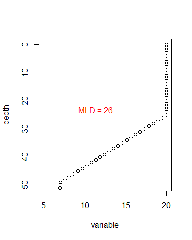

Mixed Layer Depth
================
David Kaiser
2018/01/18

Description
-----------

A function to calculate the depth of the surface mixed layer of a water column, defined as the depth at which a reference parameter changes beyond a given threshold relative to the first value.

Arguments
---------

*depth* -- vector for depth (in distance or pressure), can be negative but results will be positive

*variable* -- temperature or density

*threshold* -- the max difference of *variable*, relative to the surface, that marks the end of the MLD

*depth.max* -- maximum depth to be plotted, uses absolute value of max depth if no value is supplied

Result
------

The output is a printed human readable result, a plot showing the data and the resulting mixed layer depth (if any) or the threshold values, and a numeric value of the result. The result storable in an object (or as value e.g. in a data frame) is the numeric value. If the threshold is not exceeded the result will be NA. This is prefereable to using the max depth as the data might not include the entire water column and might thus not reach the thermo/pycnocline.

Example
-------

example data

``` r
mixed <- data.frame(depth = seq(from=0, to=99, by=1), 
                    temperature = rep(c(7,7.1), times = 50))
stratified <- data.frame(depth = seq(from=0, to=99, by=1), 
                         temperature = c(rep(20, times=25), seq(from=20, to=7, length.out=25), seq(from=7, to=5, length.out=50)))
```

For a **mixed** water column, *without* max plotting depth supplied

``` r
MLD.DK(depth = mixed$depth, variable = mixed$temperature, threshold = 0.5) 
```

    [1] "no depth.max supplied, using max(depth) instead"


    [1] "The thereshold is not exceeded. The water column is well mixed to the maximum depth of 99 [units of variable]"

    [1] NA

For a **stratified** water column, *with* max plotting depth supplied

``` r
MLD.DK(depth = stratified$depth, variable = stratified$temperature, threshold = 0.5, depth.max = 50) 
```



    [1] "mixed layer depth is 26 [units of depth]"

    [1] 26

writing the result into an **object** also prints the plot and text result

``` r
MLD <- MLD.DK(depth = stratified$depth, variable = stratified$temperature, threshold = 0.5, depth.max = 50)
```


    [1] "mixed layer depth is 26 [units of depth]"

only the **numeric value** is written into the object

``` r
MLD
```

    [1] 26

``` r
class(MLD)
```

    [1] "numeric"
