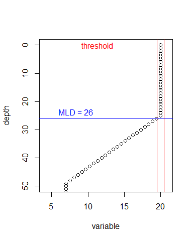
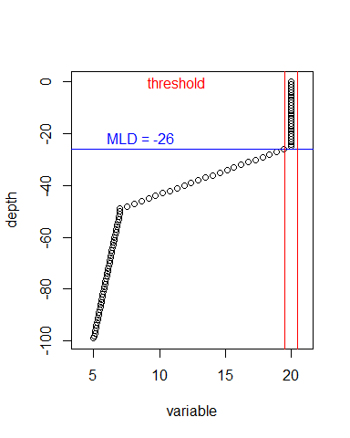

Mixed Layer Depth
================
David Kaiser
2021/08/29

## Description

A function to calculate the depth of the surface mixed layer of a water
column, defined as the depth at which a reference parameter changes
beyond a given threshold relative to the first value.

## Arguments

*depth* – vector for depth (in distance or pressure), can be negative

*variable* – temperature or density

*threshold* – the max difference of *variable*, relative to the surface,
that marks the end of the MLD

*print.info* = FALSE – should into be printed in the console as a side
effect

*plot* = FALSE – should the result be plotted as a side effect

*depth.max* = NULL – maximum depth to be plotted, uses absolute value of
max depth if no value is supplied

## Result

A numeric value of the Mixed Layer Depth. If the threshold is not
exceeded the result will be NA. This is preferable to using the max
depth as the data might not include the entire water column and might
thus not reach the thermo/pycnocline.

Former side effects of a plot showing the data and the resulting mixed
layer depth (if any) and the threshold values, and a printed explanation
of the result are now optional and off by default.

## Example

example data

``` r
mixed <- data.frame(depth = seq(from=0, to=99, by=1), 
                    temperature = rep(c(7,7.1), times = 50))
stratified <- data.frame(depth = seq(from=0, to=99, by=1), 
                         temperature = c(rep(20, times=25), seq(from=20, to=7, length.out=25), seq(from=7, to=5, length.out=50)))
```

For a **stratified** water column

``` r
MLD_DK(depth = stratified$depth, variable = stratified$temperature, threshold = 0.5) 
```

    [1] 26

For a **mixed** water column

``` r
MLD_DK(depth = mixed$depth, variable = mixed$temperature, threshold = 0.5) 
```

    [1] NA

With **side effects**

``` r
MLD_DK(depth = stratified$depth, variable = stratified$temperature, threshold = 0.5, 
              print.info = TRUE, plot = TRUE, depth.max = 50)
```

    [1] "mixed layer depth is 26 [units of depth]"



    [1] 26

With **negative depth**

``` r
MLD_DK(depth = -stratified$depth, variable = stratified$temperature, threshold = 0.5, 
              print.info = TRUE, plot = TRUE)
```

    [1] "no depth.max supplied, using maximum depth instead"
    [1] "mixed layer depth is -26 [units of depth]"



    [1] -26
